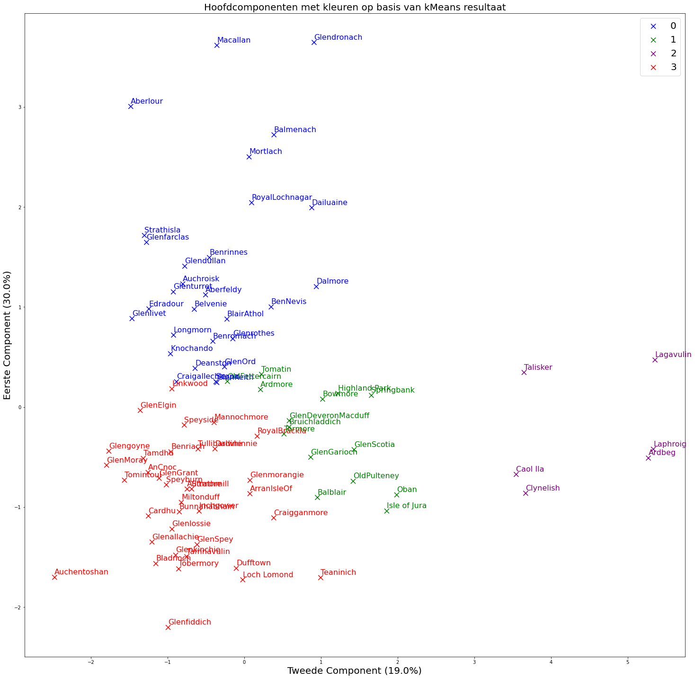

# Classifying Whiskies

This repo contains a notebook that talks us through a classification analysis of a dataset of different Scotch whiskies that are judged on several flavour profiles by experts.
I use k-means clustering to classify the whiskies and then use PCA to visualize the results. I also compare the whiskies using cosine similarities. 

2 dimensional PCA of the results on 4 clusters:

